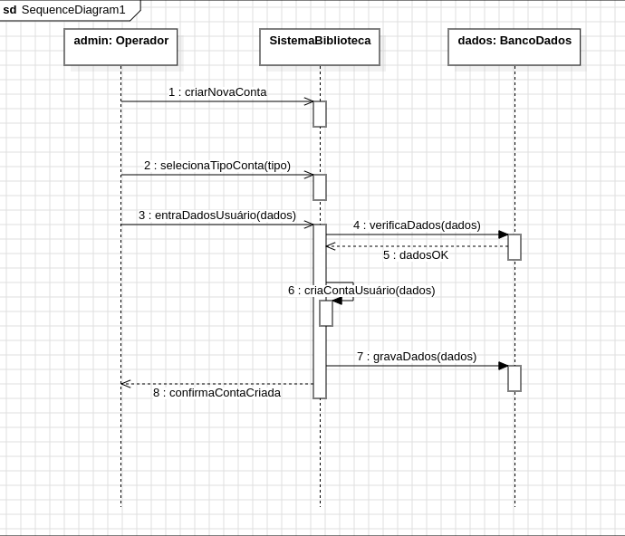

# 📊 UML Examples

  


## 📋 Descrição

Este repositório contém diversos projetos UML, incluindo diagramas e informações sobre padrões de estruturação de projetos. Ele foi criado para armazenar diagramas UML que representam o design e a estrutura de sistemas, além de fornecer exemplos e boas práticas na utilização de UML.

## 🔄 Diagrama de Sequência 

O arquivo `sistema-biblioteca-sequencia.mdj` é um exemplo de diagrama de sequência, usado para representar a ordem de execução das interações em um sistema. Ele pode ser aberto usando o software [Modelio](https://www.modelio.org/), uma ferramenta para modelagem UML.

## 📑 Padrões de Estruturação de Projetos 

O arquivo `padroes-estrutura-projetos.txt` contém informações sobre as melhores práticas e recomendações para estruturar projetos UML de maneira eficiente e organizada.

## 🖼️ Screenshots dos Arquivos

### `sistema-biblioteca-sequencia.mdj`



## 👤 Sobre o Desenvolvedor

<div align="center">

<table>
  <tr>
    <td align="center">
      <a href="https://github.com/0nF1REy" target="_blank">
        <br>
        <b>Alan Ryan</b>
      </a>
      <p>
        ☕ Peopleware | Tech Enthusiast | Code Slinger ☕<br>
        Apaixonado por código limpo, arquitetura escalável e experiências digitais envolventes.
      </p>
      <p style="font-weight: bold; color: #0077B5;">
        Conecte-se comigo:
      </p>
      <p>
        <a href="https://github.com/0nF1REy" target="_blank">
          
        </a>
        <a href="https://gitlab.com/alanryan619" target="_blank">
          
        </a>
        <a href="https://www.linkedin.com/in/alan-ryan-b115ba228" target="_blank">
          
        </a>
        <a href="mailto:alanryan619@gmail.com" target="_blank">
          
        </a>
      </p>
    </td>
  </tr>
</table>

</div>

## 📫 Contribuir

Se você deseja contribuir com o projeto, siga os seguintes passos:

1. **Faça um fork** do repositório.

2. **Crie uma branch** com a sua funcionalidade:

   ```bash
   git checkout -b feature/minha-funcionalidade
   ```

3. **Faça as alterações necessárias**.

4. **Faça um commit** com suas alterações:

   ```bash
   git commit -m "Adicionado minha funcionalidade"
   ```

5. **Envie para o repositório remoto**:

   ```bash
   git push origin feature/minha-funcionalidade
   ```

6. **Abra um pull request** para a branch `main` do projeto original.

### Documentações úteis

- **<a href="https://www.atlassian.com/br/git/tutorials/making-a-pull-request" target="_blank">📝 Como criar uma solicitação pull</a>**

- **<a href="https://gist.github.com/joshbuchea/6f47e86d2510bce28f8e7f42ae84c716" target="_blank">💾 Padrão de commit</a>**

## 📜 Licença

Este projeto está sob a licença MIT. Consulte o arquivo [LICENSE](LICENSE) para obter mais detalhes.


